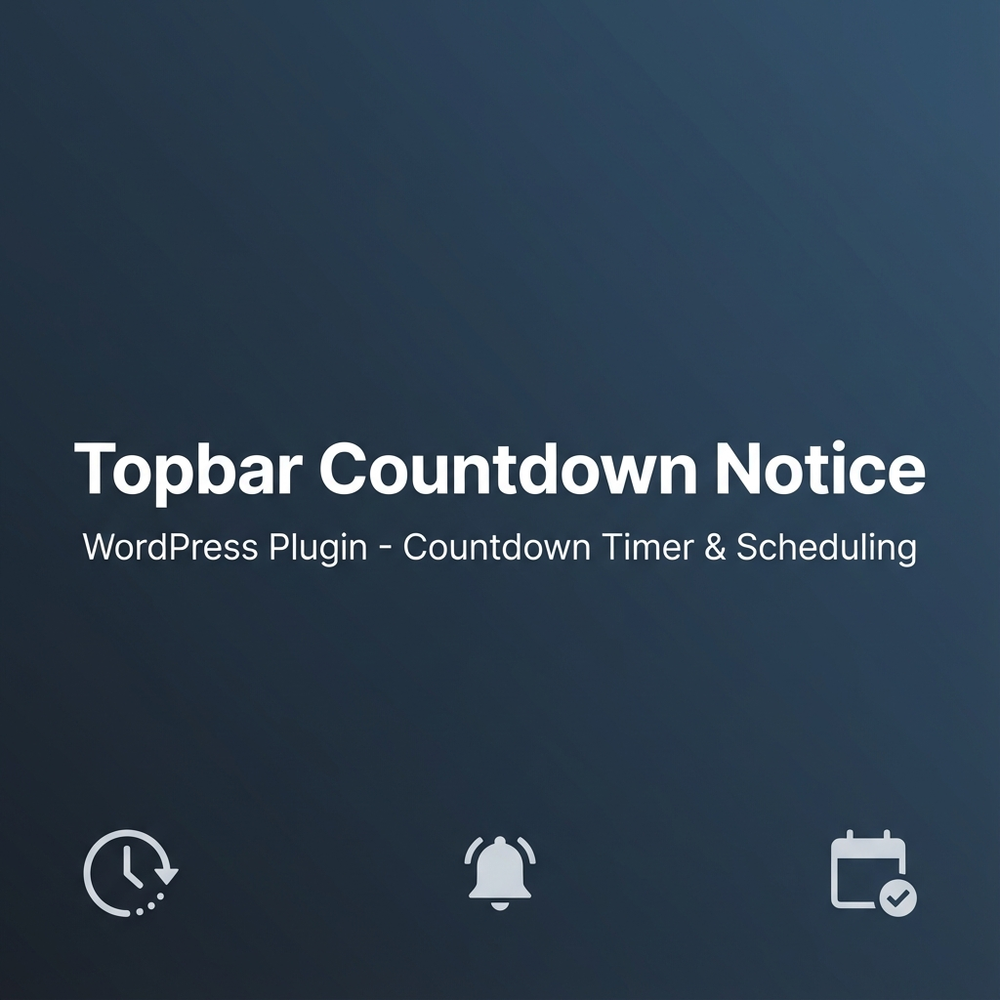
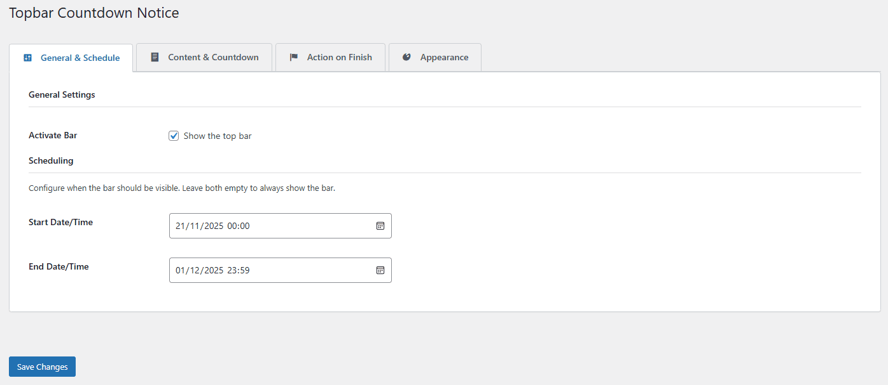
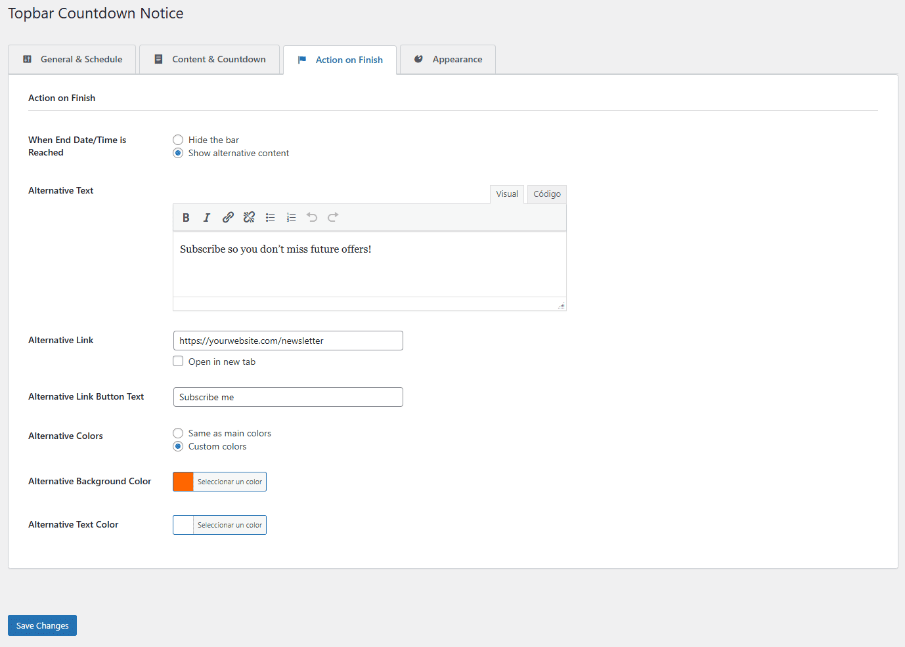

# Topbar Countdown Notice

[](https://github.com/antikton/topbar-countdown-notice)
[](https://wordpress.org/)
[](https://php.net/)
[](https://www.gnu.org/licenses/gpl-2.0.html)

A fully functional WordPress plugin that displays a customizable top bar with optional countdown timer and advanced scheduling capabilities.



## 📋 Table of Contents

- [Features](#-features)
- [Installation](#-installation)
- [Usage](#-usage)
- [Configuration](#-configuration)
- [Screenshots](#-screenshots)
- [Frequently Asked Questions](#-frequently-asked-questions)
- [Development](#-development)
- [Changelog](#-changelog)
- [Contributing](#-contributing)
- [Support](#-support)
- [License](#-license)

## ✨ Features

### Core Features

- **🌐 Global Top Bar**: Easily display a notification bar across your entire WordPress site
- **📅 Flexible Scheduling**: Set start and end dates/times for automatic bar display
- **⏱️ Countdown Timer**: Drive urgency with a countdown timer targeting a specific date
- **🔄 Alternative Content**: Show different content when the timer finishes (e.g., reveal discount coupons, announce sale start, or show "Offer Ended" messages)
- **🎨 Full Customization**: Complete visual control over colors, padding, and styling
- **📝 Rich Content Editor**: Use the familiar WordPress editor for your bar's content
- **📱 Mobile Responsive**: Fully responsive design that works on all devices
- **🎯 Action Buttons**: Add clickable call-to-action buttons with custom links

### Advanced Features

- **Custom Countdown Target**: Choose between end date or a custom target date
- **Alternative Colors**: Set different colors for expired content
- **Custom CSS Support**: Add your own CSS for advanced styling
- **Debug Mode**: Built-in debugging for troubleshooting
- **Translation Ready**: Full i18n support with text domain
- **WordPress Standards**: Follows WordPress coding standards and best practices

## 📦 Installation

### From WordPress.org (Recommended)

1. Log in to your WordPress admin panel
2. Navigate to **Plugins > Add New**
3. Search for "Topbar Countdown Notice"
4. Click **Install Now** and then **Activate**

### Manual Installation

1. Download the latest release from [GitHub](https://github.com/antikton/topbar-countdown-notice/releases)
2. Upload the `topbar-countdown-notice` folder to `/wp-content/plugins/`
3. Activate the plugin through the **Plugins** menu in WordPress
4. Go to **Settings > Topbar Countdown** to configure

### Via Composer

```bash
composer require antikton/topbar-countdown-notice
```

## 🚀 Usage

### Quick Start

1. **Activate the Plugin**: Go to **Settings > Topbar Countdown**
2. **Enable the Bar**: Check "Activate Bar" in General Settings
3. **Add Content**: Enter your message in the "Main Content" field
4. **Configure Countdown** (Optional): Enable countdown timer and set target date
5. **Customize Appearance**: Choose colors and padding to match your theme
6. **Save Changes**: Click "Save Changes" to activate your top bar

### Common Use Cases

#### 1. Limited Time Sale

```
✅ Activate Bar: ON
📅 Start Date: 2024-01-15 00:00
📅 End Date: 2024-01-20 23:59
⏱️ Countdown: ON (Target: End Date)
📝 Content: "🔥 Flash Sale! 50% OFF Everything!"
🔗 Link: /shop/sale
🎨 Colors: Red background, White text
```

#### 2. Event Announcement

```
✅ Activate Bar: ON
📅 Start Date: (empty - always show)
📅 End Date: 2024-02-14 18:00
⏱️ Countdown: ON (Target: End Date)
📝 Content: "Join our Valentine's Day Webinar!"
🔗 Link: /register
```

#### 3. Maintenance Notice

```
✅ Activate Bar: ON
📅 Start Date: 2024-01-10 22:00
📅 End Date: 2024-01-11 02:00
⏱️ Countdown: OFF
📝 Content: "⚠️ Scheduled maintenance tonight 10 PM - 2 AM"
🎨 Colors: Orange background, Black text
```

#### 4. Countdown to Promotion Start + Reveal Coupon

```
✅ Activate Bar: ON
📅 Start Date: 2024-01-10 00:00
📅 End Date: 2024-01-15 23:59
⏱️ Countdown: ON (Target: End Date)
📝 Content: "🎉 New Year Sale starts soon!"
🔗 Link: /shop

🎯 Action on Finish: Show alternative content
📝 Alternative Text: "🎁 Sale is LIVE! Use code: NEWYEAR2024 for 30% OFF"
🔗 Alternative Link: /shop/sale
🎨 Alternative Colors: Green background, White text
```
*Perfect for building anticipation before a sale starts, then revealing the discount code once it begins*

## ⚙️ Configuration

### General Settings

| Setting | Description |
|---------|-------------|
| **Activate Bar** | Toggle to show/hide the top bar globally |

### Scheduling

| Setting | Description |
|---------|-------------|
| **Start Date/Time** | When the bar should start appearing (leave empty for immediate) |
| **End Date/Time** | When the bar should stop appearing (leave empty for permanent) |

### Bar Content

| Setting | Description |
|---------|-------------|
| **Main Content** | The primary message displayed in the bar (supports HTML) |
| **Main Link** | Optional URL for the call-to-action button |
| **Main Link Button Text** | Text displayed on the CTA button (default: "Learn More") |
| **Open in New Tab** | Whether the link opens in a new browser tab |

### Countdown Timer

| Setting | Description |
|---------|-------------|
| **Activate Countdown** | Enable/disable the countdown timer |
| **Countdown Target** | Choose between "End Date" or "Custom Date" |
| **Custom Target Date/Time** | Set a specific countdown target (if Custom is selected) |
| **Countdown Prefix Text** | Text displayed before the countdown (e.g., "Ends in:") |
| **Show Seconds** | Display seconds in the countdown timer |

### Action on Finish

| Setting | Description |
|---------|-------------|
| **When End Date/Time is Reached** | Choose to hide bar or show alternative content |
| **Alternative Text** | Message shown when countdown/schedule ends |
| **Alternative Link** | Optional URL for alternative content |
| **Alternative Link Button Text** | Text for alternative CTA button |
| **Alternative Colors** | Use same colors or set custom colors for expired state |
| **Alternative Background Color** | Background color for expired content |
| **Alternative Text Color** | Text color for expired content |

### Appearance

| Setting | Description |
|---------|-------------|
| **Background Color** | Bar background color (default: #2c3e50) |
| **Text Color** | Bar text color (default: #ffffff) |
| **Padding Top** | Top padding in pixels (default: 12px) |
| **Padding Bottom** | Bottom padding in pixels (default: 12px) |
| **Padding Left** | Left padding in pixels (default: 20px) |
| **Padding Right** | Right padding in pixels (default: 20px) |
| **Custom CSS** | Add custom CSS for advanced styling |
| **Debug Mode** | Enable console logging for troubleshooting |

### Available CSS Classes

Use these classes in your Custom CSS field:

```css
.tcn-topbar              /* Main bar container */
.tcn-topbar-inner        /* Inner content wrapper */
.tcn-content             /* Main content area */
.tcn-countdown-wrapper   /* Countdown container */
.tcn-countdown-prefix    /* Countdown prefix text */
.tcn-countdown           /* Countdown timer */
.tcn-link                /* Action button/link */
```

## 📸 Screenshots

### Frontend Display

#### Active Countdown Bar

*Example of the top bar with active countdown timer showing urgency for a limited-time offer*

#### Alternative Content (After Expiration)

*Example of alternative content displayed after the countdown expires*

### Admin Settings Panels

#### 1. General & Schedule Settings

*Configure activation status and scheduling options for when the bar should appear*

#### 2. Content & Countdown Settings

*Set up your main content, call-to-action buttons, and countdown timer configuration*

#### 3. Action on Finish Settings

*Define what happens when the countdown ends - hide bar or show alternative content*

#### 4. Appearance Settings

*Customize colors, padding, and add custom CSS for advanced styling*

## ❓ Frequently Asked Questions

### Can I use this for a scheduled sale?

**Yes!** Set the Start Date/Time to when your sale begins and the End Date/Time to when it ends. Enable the countdown to target the End Date for maximum urgency.

### What happens when the countdown ends?

You have two options:
1. **Hide the bar** - The bar disappears automatically
2. **Show alternative content** - Replace with a new message (e.g., "This offer has expired")

### Is it mobile friendly?

**Absolutely!** The top bar is fully responsive and optimized for all screen sizes, including mobile devices.

### Can I reveal a discount code after the countdown ends?

**Absolutely!** This is a popular use case. Set up a countdown to build anticipation, then use the "Show alternative content" option to reveal your discount code, coupon, or special offer when the timer reaches zero. You can even change the colors to make it stand out! See the "Countdown to Promotion Start + Reveal Coupon" example in the Usage section.

### Can I customize the appearance?

**Yes!** You have complete control over:
- Background and text colors
- Padding (top, bottom, left, right)
- Custom CSS for advanced styling
- Alternative colors for expired content

### Does it work with caching plugins?

The plugin uses JavaScript for countdown functionality, which works with most caching plugins. However, for time-sensitive content, you may need to configure your cache to refresh appropriately.

### Can I translate the plugin?

**Yes!** The plugin is fully translation-ready with the text domain `topbar-countdown-notice`. You can use tools like Loco Translate or create your own `.po` and `.mo` files.

### How do I remove the bar temporarily?

Simply uncheck "Activate Bar" in the General Settings and save. This will hide the bar without losing your configuration.

### Can I show different bars on different pages?

Currently, the plugin displays a single global bar across all pages. Page-specific targeting may be added in future versions.

## 🛠️ Development

### Requirements

- WordPress 5.0 or higher
- PHP 7.4 or higher
- Modern browser with JavaScript enabled

### File Structure

```
topbar-countdown-notice/
├── assets/
│   ├── css/
│   │   ├── admin.css          # Admin panel styles
│   │   └── frontend.css       # Frontend bar styles
│   └── js/
│       ├── admin.js           # Admin panel functionality
│       └── frontend.js        # Frontend countdown logic
├── languages/                 # Translation files
│   ├── topbar-countdown-notice.pot
│   └── ...
├── topbar-countdown-notice.php # Main plugin file
├── uninstall.php              # Cleanup on uninstall
├── readme.txt                 # WordPress.org readme
└── README.md                  # This file
```

### Hooks & Filters

The plugin provides several hooks for developers:

#### Actions

```php
// Modify locale for translations
add_filter('topbar_countdown_notice_locale', function($locale) {
    return $locale;
}, 10, 2);
```

### Building from Source

```bash
# Clone the repository
git clone https://github.com/antikton/topbar-countdown-notice.git

# Navigate to the plugin directory
cd topbar-countdown-notice

# Install in WordPress plugins directory
cp -r . /path/to/wordpress/wp-content/plugins/topbar-countdown-notice/
```

### Coding Standards

This plugin follows:
- [WordPress Coding Standards](https://developer.wordpress.org/coding-standards/wordpress-coding-standards/)
- [WordPress Plugin Handbook](https://developer.wordpress.org/plugins/)
- Security best practices (sanitization, escaping, nonce verification)

## 📝 Changelog

### Version 1.0.8 (2024-12-07)

**Added:**
- Dutch (nl_NL) translation - Full plugin translation for Dutch-speaking users
- Russian (ru_RU) translation - Full plugin translation with Cyrillic alphabet support
- Japanese (ja) translation - Full plugin translation with Japanese characters (Hiragana/Katakana/Kanji)
- Polish (pl_PL) translation - Full plugin translation for Polish-speaking users

**Improved:**
- Major internationalization milestone - Plugin now available in 10 languages!
- Added support for complex plural forms (Russian: 3 forms, Polish: 3 forms, Japanese: 1 form)
- Expanded global reach covering 80%+ of WordPress users worldwide
- Added Cyrillic alphabet support (Russian)
- Added Japanese character support (Hiragana, Katakana, Kanji)

### Version 1.0.7 (2024-12-07)

**Added:**
- Italian (it_IT) translation - Full plugin translation for Italian-speaking users
- Brazilian Portuguese (pt_BR) translation - Full plugin translation for Brazilian users

**Improved:**
- Major internationalization expansion covering Romance language family
- Plugin now available in 6 languages (English, Spanish, French, German, Italian, Portuguese)

### Version 1.0.6 (2024-12-07)

**Added:**
- German (de_DE) translation - Full plugin translation for German-speaking users

**Improved:**
- Expanded internationalization support with complete .po file for German language

### Version 1.0.5 (2024-12-07)

**Added:**
- French (fr_FR) translation - Full plugin translation for French-speaking users

**Improved:**
- Internationalization support with complete .po file for French language

### Version 1.0.4 (2024-12-07)

**Added:**
- Professional banner images in multiple sizes for WordPress.org (772x250, 1544x500, 1200x300)

**Improved:**
- Reorganized assets: moved screenshots and banners to assets/ folder for WordPress.org compliance
- Updated all documentation to reflect new asset structure

### Version 1.0.3 (2024-12-07)

**Added:**
- Composer support with composer.json for Packagist installation
- Upgrade Notice section in readme.txt for WordPress.org
- Donate link support in plugin metadata

**Improved:**
- Screenshots renamed to WordPress.org standard format (screenshot-1.png, etc.)
- Full WordPress.org readme validator compliance
- Enhanced documentation for coupon reveal use cases

### Version 1.0.2 (2024-12-07)

**Added:**
- Comprehensive README.md documentation for GitHub
- 6 professional screenshots showing frontend and admin panels
- Detailed usage examples and configuration tables
- Developer documentation with hooks and file structure

**Improved:**
- Enhanced documentation with better organization
- Added visual examples of plugin functionality

### Version 1.0.1 (2024-12-06)

**Fixed:**
- Alternative background color now applies correctly when content expires
- Improved compatibility with WordPress Plugin Check (PCP)

**Improved:**
- Removed deprecated `load_plugin_textdomain` function
- All outputs properly escaped for security
- Simplified codebase by removing unnecessary hooks
- Hook names now use proper WordPress prefix standards

### Version 1.0.0 (2024-11-23)

**Initial Release:**
- Complete scheduling system
- Countdown timer functionality
- Alternative content display
- Full customization options
- Rich content editor integration
- Mobile responsive design
- Translation ready

## 🤝 Contributing

Contributions are welcome! Here's how you can help:

1. **Fork** the repository
2. **Create** a feature branch (`git checkout -b feature/AmazingFeature`)
3. **Commit** your changes (`git commit -m 'Add some AmazingFeature'`)
4. **Push** to the branch (`git push origin feature/AmazingFeature`)
5. **Open** a Pull Request

### Reporting Bugs

Found a bug? Please [open an issue](https://github.com/antikton/topbar-countdown-notice/issues) with:
- WordPress version
- PHP version
- Plugin version
- Steps to reproduce
- Expected vs actual behavior
- Screenshots (if applicable)

## 💬 Support

Need help? Here are your options:

- **Documentation**: Read this README and the [WordPress.org plugin page](https://wordpress.org/plugins/topbar-countdown-notice/)
- **Support Forum**: [WordPress.org Support](https://wordpress.org/support/plugin/topbar-countdown-notice/)
- **GitHub Issues**: [Report bugs or request features](https://github.com/antikton/topbar-countdown-notice/issues)

## 📄 License

This plugin is licensed under the [GNU General Public License v2.0 or later](https://www.gnu.org/licenses/gpl-2.0.html).

```
Topbar Countdown Notice - WordPress Plugin
Copyright (C) 2024 Eduardo Pagán

This program is free software; you can redistribute it and/or modify
it under the terms of the GNU General Public License as published by
the Free Software Foundation; either version 2 of the License, or
(at your option) any later version.

This program is distributed in the hope that it will be useful,
but WITHOUT ANY WARRANTY; without even the implied warranty of
MERCHANTABILITY or FITNESS FOR A PARTICULAR PURPOSE. See the
GNU General Public License for more details.
```

## 👨‍💻 Author

**Eduardo Pagán** ([@antikton](https://github.com/antikton))

- GitHub: [https://github.com/antikton](https://github.com/antikton)
- Plugin URI: [https://github.com/antikton/topbar-countdown-notice](https://github.com/antikton/topbar-countdown-notice)

---

**Made with ❤️ for the WordPress community**

If you find this plugin useful, please consider:
- ⭐ Starring the repository
- 📢 Sharing with others
- 💬 Leaving a review on [WordPress.org](https://wordpress.org/plugins/topbar-countdown-notice/)
- ☕ [Buying me a coffee](https://www.buymeacoffee.com/antikton) (optional)
